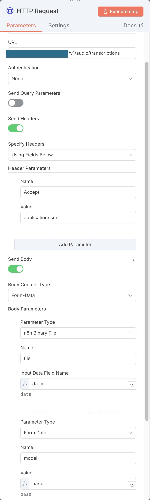

## Local Whisper Backend (large-v3-turbo)

Run `whisper_server.py` to self-host an OpenAI-compatible `/v1/audio/transcriptions` endpoint powered by [faster-whisper](https://github.com/SYSTRAN/faster-whisper). It defaults to the `large-v3-turbo` model, deploys on any machine in a few commands, and can be dropped into n8n or other workflows without code changes.

### Install dependencies

Select the installation method for your architecture:

#### 🍎 macOS (ARM64 / Apple Silicon)

**Option A: Conda (Recommended)**
Handles architecture-specific libraries (FFmpeg) automatically.
```bash
conda create -y -n whisper-env python=3.12 ffmpeg
conda activate whisper-env
pip install -r requirements.txt
```

**Option B: Standard `.venv`**
*Note: If you get "architecture mismatch" errors, ensure your FFmpeg is installed via ARM64 Homebrew (`/opt/homebrew`).*
```bash
python3 -m venv .venv
source .venv/bin/activate
pip install --upgrade pip
pip install -r requirements.txt
```

#### 🖥️ Linux/Windows/Intel Mac
```bash
python3 -m venv .venv
source .venv/bin/activate
pip install --upgrade pip
pip install -r requirements.txt
```

### Start the Whisper server

Choose the optimal settings based on your hardware:

#### 🍎 Apple Silicon (M1/M2/M3)
```bash
export LOCAL_WHISPER_MODEL=large-v3-turbo
export LOCAL_WHISPER_DEVICE=cpu
export LOCAL_WHISPER_COMPUTE_TYPE=int8
export LOCAL_WHISPER_BEAM_SIZE=1
uvicorn whisper_server:app --host 0.0.0.0 --port 9000
```

#### 🟢 NVIDIA GPU (x86_64)
```bash
export LOCAL_WHISPER_MODEL=large-v3-turbo
export LOCAL_WHISPER_DEVICE=cuda
export LOCAL_WHISPER_COMPUTE_TYPE=float16
uvicorn whisper_server:app --host 0.0.0.0 --port 9000
```

#### 🖥️ Generic CPU (x86_64)
```bash
export LOCAL_WHISPER_MODEL=large-v3-turbo
export LOCAL_WHISPER_DEVICE=cpu
export LOCAL_WHISPER_COMPUTE_TYPE=int8_float32
uvicorn whisper_server:app --host 0.0.0.0 --port 9000
```

If a compute type is unsupported (for example `float16` on CPU), the server automatically retries with `int8` or `auto` based modes. The service also aliases `large-v3-turbo` to `large-v3` because `faster-whisper` uses the base model name for the turbo weights.

The server exposes:

- `POST /v1/audio/transcriptions` – accepts multipart/form-data (`file`, optional `model`) or allows `?model=` as a query parameter and returns OpenAI-style JSON with `text` and `segments`.
- `GET /healthz` – readiness probe.

### Example request (curl)

```bash
curl -sS -X POST http://127.0.0.1:9000/v1/audio/transcriptions \
  -H "Accept: application/json" \
  -F "file=@file_0.oga;filename=file_0.oga;type=audio/ogg" \
  -F "model=small"
```

### Wire it up to the main API

In the environment that runs `main.py`, point the integration to the local server:

```bash
export WHISPER_BASE_URL=http://127.0.0.1:9000/v1
export WHISPER_MODEL=large-v3-turbo
export TMP_DIR=/tmp/yt-audio
uvicorn main:app --host 0.0.0.0 --port 5005
```

Your YouTube transcription endpoint will now fall back to the self-hosted Whisper large-v3-turbo server whenever subtitles are unavailable.

### Run as a systemd service

1. Update `User=` and the absolute paths in `whisper-local-api.service` if your repo lives somewhere other than `/mnt/ssd/whisper-local-api`.
2. Optionally create `/etc/default/whisper-local-api` to override defaults (e.g. `LOCAL_WHISPER_MODEL=large-v3-turbo`, `LOCAL_WHISPER_DEVICE=auto`, `LOCAL_WHISPER_COMPUTE_TYPE=float16`).
3. Install and enable the service:
   ```bash
   sudo cp whisper-local-api.service /etc/systemd/system/
   sudo systemctl daemon-reload
   sudo systemctl enable --now whisper-local-api.service
   ```
4. Check status and logs:
   ```bash
   systemctl status whisper-local-api.service
   journalctl -u whisper-local-api.service -f
   ```

### Use with n8n

The server is OpenAI-compatible, so you can drop it into n8n’s “OpenAI Audio Transcription” (or HTTP Request) node by pointing the base URL to your instance:

- Base URL: `http://<your-host>:9000/v1`
- Endpoint: `/audio/transcriptions`
- Model: `large-v3-turbo` (or whichever you’ve preloaded)
- Auth: none required (unless you front it with your own proxy)

Example n8n configuration:



### Notes and troubleshooting

- Models must already be present on disk; if a requested model is missing the API returns `503` with guidance to download it first.
- Successful requests log a short transcript preview to help spot test results in the logs.
- The server will fall back to a supported compute type if the preferred one (e.g., `float16` on CPU) fails.

### Run the test suite

Tests live in `tests/test_whisper_server.py` and use the bundled `test-speech.mp3` fixture; they mock the transcription call so they run offline and quickly.

```bash
source .venv/bin/activate
pytest
```

### OpenClaw Skill (ClawHub)

If you use OpenClaw and want one-command agent setup, use the packaged skill from this repo:

- Skill source: `openclaw-skill/whisper-local-api/`
- Privacy focused: Provides 100% offline, highly-accurate `faster-whisper` transcription for agent voice commands without cloud telemetry

Package command to deploy to ClawHub:
```bash
python ~/.npm-global/lib/node_modules/openclaw/skills/skill-creator/scripts/package_skill.py openclaw-skill/whisper-local-api
```
This generates a `.skill` bundle you can securely upload.
